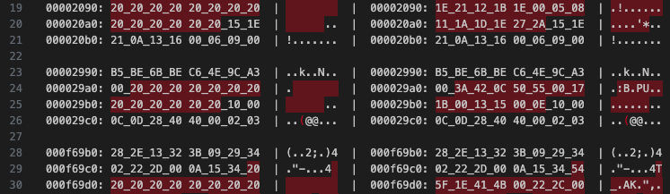
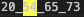
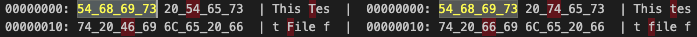

# Change Log

All notable changes to the "hexdiff" extension will be documented in this file.

## Version 1.2.240121
- Change user setting (bool to enum type)
- Add [[README.md#User manual]]

## Version 1.2.231204
- Fix Identical file message

## Version 1.2.231203
- Contrast mode!! (Hide common data)
 - 

## Version 1.1.231119
- Add overview ruler(minimap)!
- Optimize for speed
- Fix filepath
- Limit file size(2M)

## Version 1.0.231117
- Fix filepath

## Version 1.0.231116
- Icon!!
- User setting(background color)
  - 

## Version 1.0.231115
- Add keywords(for search)
- Add changelog
- Show hexdiff status bar on hexdiff document
- User setting (bytes/line, 4bytes print)
  - 

## Version 1.0.231114
- Initial release