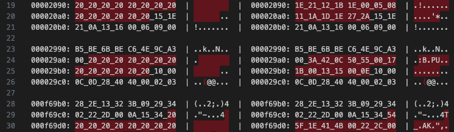

# vscode-hexdiff
- hexdiff for Visual Studio Code
- This extension is a view-only tool that does not support editing

## Main Features
* Show difference of two binary file
  * Contrast mode(Default)
    * Shows the differences and the context around them
    * Fast.
  * Compare mode
    * Shows the entire file
* Navigate through differences
  * Go to next difference(F8)
  * Go to previous difference(F7)
* See your current position
  * 

## User manual
* how to open diff window
  * select two file in file list
    * click file1
    * ctrl(or ⌘) + click file2
    * right click
  * click "Compare Selected(Hexdiff)"
* adjust other values
  * open user settings (ctrl+shift+p)
  * edit default mode and context size
  * reload window

## Screen shots
* how to open
  * 
* Editor
  * 
* Contrast Mode
  * 
* Bytes per line [8,16]
* 4bytes chunk
  * 

# License
[MIT](LICENSE.md)