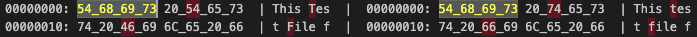

# vscode-hexdiff
hexdiff for Visual Studio Code

## Main Features
* Compare two binary files in hexadecimal mode
* Contrast Mode (Default)
* Go to next difference(F8)
* Go to previous difference(F7)
* Display position on the status bar (bottom right)
  * 
* 
* 
* 

## Options
* Bytes per line [8,16]
* 4bytes chunk
  * 

## License
[MIT](LICENSE.md)